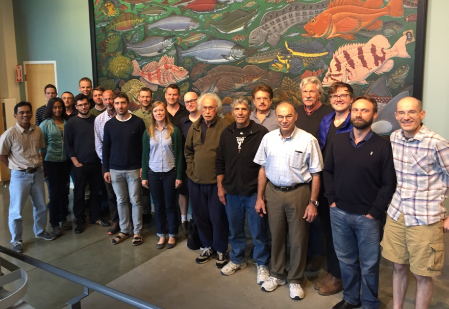

Report Developers Workshop 2016
===============================

June 20 - 24, 2016

University of Washington, School of Aquatic and Fisheries Sciences

Seattle, Washington, USA

Contents
--------

* [Description](#description)
* [Agenda](#agenda)
  * [Schedule](#schedule)
  * [Breakout Groups Topics](#breakoutgroups)
* [Presentations](#presentations)
* [Discussions](#discussions)
  * [Breakout Groups Discussions](#discussionbreakoutgroup)
* [ADMB Foundation Meeting](#admbfoundation)
* [Accomplishments](#accomplishments)
  * [Priorities](#priorities)
* [Appendix](#appendix)
  * [Participants](#participants)



<a name="description"/>
Description
===========

This report summarises the events of the 6th ADMB Developer’s Workshop, a meeting held at the University of Washington School of Aquatic and Fisheries Sciences, Seattle Washington. The meeting was attended by many ADMB and TMB core developers and were joined by invited European and American experts. These experts introduced their software development experiences in similar types of challenges. 

The meeting was held in the typical informal style, allowing open group discussions and demonstrations of new features, possible improvements, and current issues. Meeting participants spent considerable time working in sub-groups, each of which tackled a related set of priority issues for the ADMB project.

Participants are included in an [appendix](#appendix) to this document. Jim Ianelli chaired the majority of the workshop, with much assistance from Arni Magnusson and Mollie Brooks.  Gavin Fay and Johnoel Ancheta along with others acted as rapporteur and compiled and edited this report. An ADMB foundation meeting was held at the conclusion of the workshop and new members and board was appointed.

The workshop was broadcasted via the internet to allow for remote participation.

<a name="agenda"/>
Agenda
======

The main **objectives** of the workshop are

* Plan and develop instructional videos
* Coordinate between TMB and ADMB Projects
* Further develop MCMC implementations
* Review new website design (converted from plone to wordpress)
* Hold an ADMB Foundation meeting

Schedule
--------

The following outlined the agenda and schedule that was followed.

**Monday, June 20**

_Opening and Instructional Videos_

|Time|Speaker|Activity|
|:---|:------|:-------|
|9:00AM||Opening: revision and approval of agenda; assignment of repporteurs|
|10:00AM|Arni Magnusson|ADMB-IDE, rolling out version 11.5, people willing to help out? Also, a quick review of TMB-IDE.|
|11:00AM|Discussion|
|1:00PM||**Lunch**|
|2:30PM|Mollie Brooks|The glmmTMB package for flexible mixed models in R|
|3:30AM|Jim Thorson|Progress with spatio-temporal analysis of multivariate  (e.g., species or sizes) data using TMB, and how statistical developments might help|
|4:30PM||Discussion|
|5:00PM||**End**|

**Tuesday, June 21**

_Miscellaneous Topics_

|Time|Speaker|Activity|
|:---|:------|:-------|
|9:00AM||Overview of R packages based on ADMB and TMB. Discuss potential new R package, `TMBextras`. Also write up (or find existing write-up?) description of how to create a user-level C++ library.|
|10:00AM|Chair Hans Skaug|Creation of Instructional videos|
|11:00AM||Split into breakout groups|
|Noon||**Lunch**|
|1:00PM||Breakout groups|
|2:00-3.00PM||*PLENARY SESSION:* Subgroups report on initial ideas, progress, and goals|
|3:00-5:00PM||Breakout groups|
|5:00PM||**End**|

**Wednesday, June 22**

_TMB / ADMB Coordination_

|Time|Speaker|Activity|
|:---|:------|:-------|
|9:00AM|Johnoel Ancheta|Website: [review](#newwebsite) new WordPress alternative to Plone.|
|||Breakout groups|
|1:00PM|| **Lunch** |
|||Breakout groups|
|5:00PM||**End**|

**Thursday, June 23**

_The use of AD in statistical software_

|Time|Speaker|Title|
|:---|:------|:----|
|9:00AM|David Fournier |The use of higher order AD to develop a multinomial like M estimator for the analysis of compositonal data with an application to fisheries management models |
|10:00AM|Brad Bell|cppad_mixed: A C++ Package for Laplace Approximation of Mixed |
|11:00AM||Break |
|11:30AM|Bob Carpenter|Implementation and Application of Reverse-Mode Autodiff in Stan|
|1:00PM|| **Lunch** |
|2:00PM|Kasper Kristensen |TMB: Automatic Differentiation and Laplace Approximation|
|3:00PM|Cole Monnahan|Hamiltonian Monte Carlo in ADMB and TMB: current status and future directions|
|4:00PM|Matthew Supernaw|ATL and Higher-Order Reverse Mode AD|
|5:00PM||**End**|

**Friday, June 24**

_Foundation Meeting and Conclusion_

|Time|Activity|
|---|---|
|9:00AM|Discussion: How can the TMB and ADMB Projects support one another (Chair Jim Ianelli)|
| |Outreach|
| |More training workshops|
| |Fund raising|
| |Possible relocation of project|
|2:00PM|ADMB Foundation Meeting|
||Discuss Articles of Incorporation|
||Relocation of project|
||Election of officers|
|4:00PM|**End**|

<a name="presentations"/>
Presentations
=============

Arni Magnusson's presentations [AD Model Builder IDE](https://github.com/admb-project/June2016-Developers-Workshop/blob/master/presentations/admb-tmb-ide/admb-ide.pdf), [TMB-IDE](https://github.com/admb-project/June2016-Developers-Workshop/blob/master/presentations/admb-tmb-ide/tmb-ide.pdf) and [Virtual TMB](https://github.com/admb-project/June2016-Developers-Workshop/blob/master/presentations/admb-tmb-ide/virtual-tmb.pdf).

Jim Thorson's presentation [Advancements in spatio-temporal models in TMB](2016-06-20--advancements-in-spatio-temporal-models.pptx).

John Sibert's presentation [A Newbie Ports ADMB to TMB](https://github.com/admb-project/June2016-Developers-Workshop/blob/master/presentations/newbie_slides.pdf).

On Thursday, the workshop was devoted to a series of presentations on alternative approaches (e.g., Stan) and activities where ADMB/TMB are being actively used.

David Fournier's presentation [The use of higher order AD to develop a multinomial like M estimator for the analysis of compositonal data with an application to fisheries management models](). **N/A**

Brad Bell's presentation [cppad_mixed: A C++ Package for Laplace Approximation of Mixed](). **N/A**

Bob Carpenter's presentation [Stan a Probalistic Programming Language](https://github.com/TMB-ADMB-Workshops/June2016-Developers-Workshop/blob/master/presentations/stan-admb-talk-2016.pdf) on Stan implementation and issues.

Kasper Kristensen's presentation [Template Model Builder](https://github.com/admb-project/June2016-Developers-Workshop/blob/master/presentations/tmb_presentation.pdf).

Cole Monnahan's presentation [Hamiltonian Monte Carlo in ADMB and TMB: current status and future directions](https://github.com/admb-project/June2016-Developers-Workshop/blob/master/presentations/HMC-in-ADMB-and-TMB.pdf).

Matthew Supernaw's presentation [ATL and Higher-Order Reverse Mode AD](https://github.com/msupernaw/ATL). **N/A**

<a name="breakoutgroups"/>
Breakout Groups Topics
======================

Breakout group topics were developed at the workshop.

Below is created list of topics for the breakout groups:

_Topics with links were discussed._

* [ADMB-IDE 11.5](#groupadmbide)
* cppad_mixed
* [Instructional videos](#groupvideos)
* [Nvidia GPU](#groupnvidiagpu)
* [TMB with GPU](#grouptmbgpu)
* Non-normal RE (rotational Bayes)
* [Cross validation methods](#groupvalidation)
* MCMC (Riemann with Langevin updates)
* [XSSA demo of Sibert](#groupxssa)
* GLMM/TMB Package: another distribution could be added; hurdle model generalized Poisson
* [Atomic functions and use of derivatives within the template (e.g., newton raphson's within the template)](#groupatomic)
* Debugging demonstration and documentation reference
* [Discuss getting better sparseness detection in ADMB](#groupsparse)
* Posfun in TMB
* [Protocol for contributing code](#groupcontributecode)
* [Website issues](#groupwebsiteissues)
* Rank order -1 problem
* 3rd order derivatives
* [NUTS algorithm in ADMB](#nutsinadmb)
* Get install_github() to do source("install_windows.R") when Windows is detected
* Non-normal RE (rotational Bayes)
* Create TMB page on Wikipedia
* glmmTMB publication planning

<a name="discussions"/>
Discussions
===========

Relative to these tasks, the following lists activities and progress for the breakout groups.
Also, [other discussions](#otherdiscussions) were noted.

**<a name="admbide">ADMB-IDE</a>**

Arni also presented the status of ADMB-IDE 11.5 and a sub-group was formed to help w/ maintenance of this package that is commonly used.

Also, see breakout group discussions [ADMB-IDE](#groupadmbide).

**<a name="groupvideos">Instructional videos</a>**

* An excellent instructional video was developed by Mollie, Hans, and Arni.

**<a name="newwebsite"/>Website: review new WordPress alternative to Plone.</a>**

The www.admb-project.org site should be moved to a new host site because of the uncertainty for support from NCEAS.
Since most commercial internet web sites do not support Plone and python, Wordpress was chosen for to host the website pages.

The workshop reviewed the new website design and developed text describing expanded roles of the Foundation to
help support the TMB activities and embrace alternative approaches to software development.

The draft website is at http://admb-project-org.admb-foundation.org/.

Also, see breakout group discussions [Website Issues](#groupwebsiteissues).

<a name="discussionbreakoutgroup"/>
Breakout Groups
---------------

Each group presented a short report on the groups effort.

**<a name="groupadmbide">ADMB-IDE</a>** 

_Arni, Chris Grandin and Johnoel_

Arni provided the [dependancy list](https://raw.githubusercontent.com/admb-project/admb/master/contrib/ide/make.txt).  Started configuring the ide build procedure into the automated builds ([buildbot](http://buildbot.admb-project.org/)).

_Task_

* Continue to configure buildbot for ADMB-IDE.

**<a name="groupcontributecode"/>Protocol for contributing code</a>**

* R package of contributed functions
   * Kasper added a directory called “TMB_contrib_R” to “kaskr” github page
      * He’s working on a function as part of package to install these into right place so they get compiled
   * Contains subdirectories that can be installed using devtools R package installer
   * Examples include:
      * Jim Thorson added TMBdebug
      * Gavin is working on TMBphase using example code from Mollie
         * Phasing within an optimizer
         * Function with normal inputs, passed via “...”, plus two additional arguments, “phase” and “optimizer”
         * Optimizer by default is nlminb
         * phase is a tagged list where missing elements are populated with a vector of 1s, and non-missing elements are integers, and where the optimizer loops through values of phase while progressively changing map to turn on parameters
         * Function works, needs testing.
         * https://github.com/gavinfay/TMBphase
         * devtools::install_github(“gavinfay/TMBphase”)
         * GF tested using thetalogistic example.
         * Example usage in Roxygen documentation for TMBphase()
         * Not implemented choice of optimizer yet.
      * Maybe Cole will add TMBmcmc, which would entail moving the MCMC code currently in the TMB package into TMBmcmc.
      * It would be nice to have an AIC function that works as AIC(fit <- nlminb(mod$par, mod$fn, mod$gr)). See TMBAIC at https://github.com/kaskr/adcomp/wiki/FAQ
         * THIS has now been added to TMBhelper in the user-contributed directory
      * It would be nice to have an elem_prod() function.
* Kasper created a function allowing contributed cpp code to be used in a TMB model. See example https://github.com/kaskr/example_cpp
   *  Thorson, Kasper, Mollie (testing Friday)

**<a name="groupwebsiteissues">Website issues</a>**

_By John Sibert, Johnoel and Mollie._

Revised frontpage text of draft website at http://admb-project-org.admb-foundation.org/.

_Task_
* Add DTU and Coin-R logos (DTU and Coin-R) to website footer.
* Continue to finalize the website.

**<a name="groupnvidiagpu">Nvidia GPU</a>**

* Parallelization: Dave has open CL version of the function minimizer that could be used as an example of how the GPU approach might be beneficial.
* Successfully configured the ADMB linux server for Nvidia GPU development support.  
Kasper tested and ran R numerical functions with the GPU.  The results showed speed improvements compared to single core cpu runs.

_Task_

* Take a look at Dave's GPU code for the minimizer.

**<a name="grouptmbgpu">TMB with GPU</a>**

Gavin Fay's experience using TMB with GPU card is [available](https://github.com/TMB-ADMB-Workshops/June2016-Developers-Workshop/blob/master/presentations/tmb_with_gpus/TMB_with_GPU_Fay_20160624.pdf) on the github repository.

**<a name="groupxssa">XSSA demo of Sibert</a>**

See the XSSA code repository at [State-space Stock Assessment with population exchange](https://github.com/johnrsibert/XSSA).

**<a name="groupatomic">Atomic functions and use of derivatives within the template (e.g., newton raphson's within the template)</a>**

An example presentation of Atomic functions and use of derivatives within the template (during Kasper's presentation)

**<a name="groupgradients">Compare gradients</a>**

* Matthew's AD example comparing gradients with ADMB and TMB was double checked.
* Anders Nielsen has done gradients comparison checks for TMB and ADMB using the examples.  They will be releasing a paper that details the results.  For most of the examples, TMB and ADMB are the same.  However, the inv_cumd_beta_stable did not produce similar gradients.  It was discovered the inv_cumd_beta_stable function in ADMB was incorrect.  They already have a fix and will merge into the admb master.

**<a name="groupsparse"/>Sparse Detection</a>**

It was noted that there would be advantages to having sparseness detection built into ADMB as it is with TMB.

_Task_

* Look into adding sparse detection for ADMB from the TMB code.

**<a name="groupvalidation"/>Cross validation methods</a>**

The topic of model selection approaches (e.g. Cross validation methods, Conditional AIC, 1 step predict) was raised and it was noted that in the directory (see existing [example](https://github.com/kaskr/adcomp/tree/master/tmb_examples/validation)).

**<a name="groupsparse"/>TMB Script</a>**

A sub-group endeavored to run cppad_mixed, using cppad without the TMB layer while another group led by Anders developed a simple script (see below) to show that TMB can be used for non-R folks.

```
echo "source(\"script.R\"); runit(\"$1\")" | R --vanilla
```

**<a name="groupsparse"/>TMB Users</a>**

Created [TMB Users](https://groups.google.com/forum/#!forum/tmb-users) google group so that users can answer each other's questions rather than load up the "issues" on the TMB github repository.

**<a name="nutsinadmb">Nuts algorithm in ADMB</a>**

Cole Monnahan led discussions about the current state and future directions of Hamiltonian Monte Carlo in both TMB and ADMB. This included the prospect of adding Riemannian HMC and "variational inference." Bob Carpenter noted the difficulties with ADVI, but that RHMC is very promising for models up to hundreds of parameters with very difficult posterior geometries. Thus, the short-term goals are to get NUTS with adaptation of the step size and mass matrix in both TMB/ADMB. The longer term would be to get RHMC updates working with NUTS. Cole, Dave and Johnoel will work toward this goal over the next 6 months.

**<a name="otherdiscussions"/>Other Discussions</a>**

* Bob Carpenter and Brad Bell led discussions about autodiff in general and announced that there will be a workshop in Oxford (still time to submit a poster abstract).

* Several began planning spatio-temporal textbook using TMB.

* Fix sdreport() for singular hessian cases (avoid crash, just output NaN)

* Include an option to suppress warnings from CHOLMOD during optimization

  _Notes_

  Now the warnings are disabled by default. They can be activated by adding

  ```
  newtonOption(obj,silent=FALSE)
  ```

  However, you will know that they would have been generated if “ustep” is less than one.

<a name="admbfoundation"/>
ADMB Foundation Meeting
=======================

**Funding**

Steve Martell suggested getting funding from the commercial fisheries.  They are looking to fund real-time fish tracking tools.

**Election**

Voted on new members:

* Allan Hicks
* Kasper Kristensen
* James Thorson
* Cole Monnahan
* Gavin Faye

Elected new board member officers:

* President is Arni Magnusson.
* Treasurer is Allan Hicks.
* Secretary is Mollie Brooks.

<a name="accomplishments"/>
Accomplishments
===============

One of the objectives of the workshop is to identify priorites for the projects which include tasks and potential new features.

<a name="priorities"/>
Priorities
----------

**Tasks**

* Automate ADMB-IDE builds
* Website: Move from NCEAS to another web host
* Documenting the source code
* Website: Add DTU Aqua in footer
* Video: Provide youtube link to instructional video
* ADMB: Merge inv_cumd_beta_stable fixes
* Continue collaboration with TMB, cppad and Stan projects.

**Potential new features**

* [NUTS algorithm into ADMB](#nutsinadmb) - Cole
* [GPU Parallelization](#groupnvidiagpu) in ADMB code

Collaboration
-------------

Anders Nielsen urges to keep maintaining more than one tool for automatic differention.


As the breakout groups has shown, both TMB and ADMB projects (as well as Stan) can benefit from collaboration.

Kasper Kristensen and Anders Nielsen presentation outlines an [Example on joint ADMB/TMB development effort](https://github.com/admb-project/June2016-Developers-Workshop/blob/master/presentations/joint.pdf).

Rick Methot and Matthew Supernaw were in attendance.

<a name="appendix"/>
Appendix
========

Notes
-----

* Mollie Brooks' breakout group [notes](https://docs.google.com/document/d/1b0jWcGYNh-jCcJdgx7m8DehWu44AS4jhNbi-205yTiY/edit).

* Gavin Fay's workshop [notes](https://raw.githubusercontent.com/admb-project/June2016-Developers-Workshop/master/notes/GF_notes_20160620.txt).

<a name="participants"/>
Participants
------------

|Name|Notes|
|---|---|
|Dave Fournier|Otter Research|
|John Sibert|ADMB Project, JIMAR, University of Hawaii|
|Jim Ianelli||
|Steve Martell||
|Anders Nielsen||
|Hans Skaug||
|Arni Magnusson||
|Kasper Kristensen| Developer TMB |
|Brad Bell| Developer cppad |
|Mollie Brooks||
|Matthew Supernaw| Developer atl |
|Teresa A'mar||
|Chris Grandin||
|Casper Berg||
|Cole Monnahan||
|Jim Thorson||
|Bob Carpenter|Stan Project|
|Johnoel Ancheta|ADMB Project, JIMAR, University of Hawaii|
|Gavin Fay||
|Allan Hicks|IPHC|
|Kyle Foreman||
|Rick Methot||
|Athol Whitten|Remote participation|
|Jeff Laake|Remote participation|
